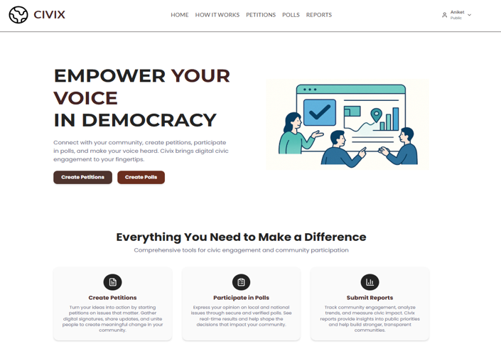

# Civix - Digital Civic Engagement & Petition Platform

A full-stack digital platform that empowers citizens to engage in local governance through petitions, polls, voting, and tracking officials' responses. Built as part of the Infosys 2025 Internship Program - Civic Team 03.

---

## 📝 Project Description

**Civix** enables citizens to participate in civic activities by:
- Creating and signing petitions for community issues
- Voting in public sentiment polls
- Providing feedback on polls
- Tracking responses and engagement reports

**Problem it Solves**: Bridges the gap between citizens and local governance by providing a transparent platform for community-driven advocacy and accountability.

---

## 🛠️ Tech Stack

**Frontend:**
- React 18
- TypeScript
- Vite (Build Tool)
- Tailwind CSS
- Shadcn/ui Components
- Fetch API

**Backend:**
- Node.js
- Express.js
- JWT Authentication
- Bcrypt (Password Hashing)

**Database:**
- MongoDB (MongoDB Atlas)

**Tools:**
- Git & GitHub
- Nodemailer (Email Service)
- Express Rate Limit
- CORS, Helmet

---

## ✨ Features

- ✅ **User Authentication** - Secure signup/login with JWT and email verification
- ✅ **Petition Management** - Create, edit, sign, and filter petitions by location/category
- ✅ **Public Polling** - Create polls, vote, and view live sentiment results
- ✅ **Poll Feedback** - Submit and manage feedback on civic issues
- ✅ **Governance Dashboard** - Officials track petitions and respond with updates
- ✅ **Reports & Analytics** - Monthly civic engagement reports with exportable data
- ✅ **Role-Based Access** - Different permissions for citizens, officials, and admins
- ✅ **Email Notifications** - Automated updates for important events
- ✅ **Geo-Tagging** - Location-based petition filtering

---

## 📁 Project Structure

```
civix/
├── backend/                 # Express.js API server
│   ├── routes/             # API endpoints (auth, petitions, polls, reports)
│   ├── models/             # MongoDB schemas (User, Petition, Poll)
│   ├── middleware/         # Authentication & validation
│   ├── services/           # Email service
│   ├── config.js           # Configuration
│   └── server.js           # Main server file
├── frontend/               # React + Vite client
│   ├── client/
│   │   ├── components/     # Reusable UI components
│   │   ├── pages/          # Application pages
│   │   ├── lib/            # API client & utilities
│   │   └── App.tsx         # Main app component
│   ├── public/             # Static assets
│   └── vite.config.ts      # Vite configuration
└── README.md               # This file
```

---

## 🚀 Installation & Setup

### Prerequisites
Node.js (v14+), npm/yarn, MongoDB Atlas account

### Steps

**1. Clone Repository**
```bash
git clone https://github.com/springboardmentor103/internship_infosys_2025_civic_team_03.git
cd internship_infosys_2025_civic_team_03
```

**2. Install Dependencies**
```bash
# Backend
cd backend
npm install

# Frontend
cd ../frontend
npm install
```

**3. Run Application**
```bash
# Terminal 1 - Backend 
cd backend
node server.js

# Terminal 2 - Frontend
cd frontend
npm run dev
```

---

## 📸 Screenshots 

### Dashboard


### Petitions Page


### Polls Page


### Reports Page


---

## 👥 Contributors

**Civix Team - Infosys 2025 Internship Program - Civic Team 03**
- [Kodali Lohitha](https://github.com/lohi-cell)
- [Bontha Vijay](https://github.com/Vijay-1807)
- [Deepak](https://github.com/Deepakkumarkhatoi)
- [Aniket](https://github.com/Aniket-876)

---

## 📄 License

This project is licensed under the MIT License - see the `license/LICENSE` file for details.

---

